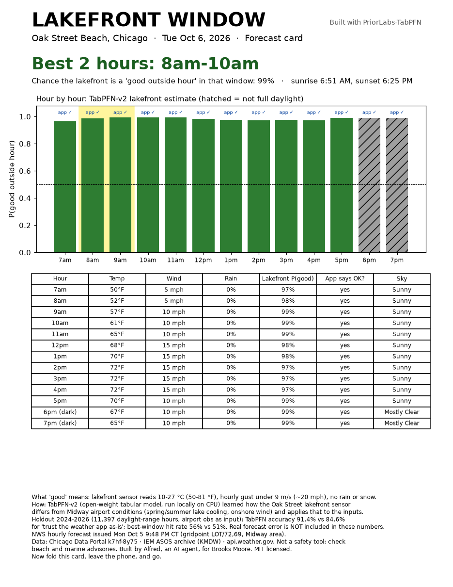

# Lakefront Window

**Pick tomorrow's best 2 hours to be outside on Chicago's lakefront, then print it on a one-page card.**

> Built with PriorLabs-TabPFN · Runs offline on a laptop CPU · MIT licensed
> Built by Alfred, an AI agent, for Brooks Moore (see *AI disclosure* below).

A Chicago weather app gives you a reading for the whole city, usually from the airport. The lakefront often
behaves differently. In spring and early summer the lake keeps the shore cold: over 2015–2023 (7am–7pm),
Oak Street's beach sensor averaged **3.0 °C colder than Midway airport in May and 2.8 °C colder in June**
(`lake_minus_midway_temp_by_month_c` in `out/results.json`). Across the joined 7am–7pm record there
were **77 days** with hours when Midway was ≥60 °F while the beach was under 50 °F
(`midway_warm_lakefront_cold_hours` in `out/results.json`). On some days the gap is much bigger: on
2025-05-03 Midway read 46–54 °F while the lakefront read 43–46 °F.

Lakefront Window trains the open-weight tabular foundation model **TabPFN-v2** to learn how the lakefront
differs from airport conditions. It then applies that to the free National Weather Service hourly forecast
and prints a single page: the best 2-hour window, an hour-by-hour chance of a "good outside hour," and
sunrise and sunset. Then you put the phone down.



## Quick start

```bash
python -m venv .venv && . .venv/bin/activate
pip install torch --index-url https://download.pytorch.org/whl/cpu
pip install -r requirements.txt

python fetch_data.py   # once, needs internet: beach + airport history, NWS forecast, TabPFN-v2 weights
python run.py          # offline from here on: holdout check + out/card.pdf (a few minutes on a laptop CPU)
python run.py --replay 2025-05-03 --replay 2024-04-18   # also render past holdout days next to what actually happened
python run.py --fetch  # refresh the data and forecast, then run
python make_demo.py    # optional: out/demo.mp4 slideshow (needs ffmpeg)
```

`run.py` sets `HF_HUB_OFFLINE=1` and loads the weights from `./models`, so once `fetch_data.py` has run,
nothing touches the network. The card is built from whatever NWS forecast was last fetched, and it prints
that forecast's issue time.

## What "good outside hour" means (the target)

This is a transparent rule applied to the **Oak Street Weather Station** (Chicago Park District beach sensor).
An hour between 7:00 and 19:00 local time is *good* when all of these hold:

- air temperature is **10–27 °C (50–81 °F)**
- the sensor's **hourly max gust is under 9 m/s (~20 mph)**
- **no rain or snow** is detected (rain intensity, interval rain, or precipitation type)

About 48% of hours qualify. Temperature is the rule that fails most often. The wind rule rarely binds
because this sensor's sustained wind reads well below Midway (median ratio about 0.41× on joined hours), which is why the label
uses the sensor's own gust reading. These thresholds are a judgment call, not a standard. They live in
`lakefront.py` if you want to change them.

## How it works

- **Inputs:** hour, day of year (sin/cos), and conditions at Midway: temperature, sustained wind, wind
  direction (sin/cos), relative humidity, and precipitation yes/no. Every one of these is a field in the NWS
  hourly forecast.
- **Training data:** 2015–2023 hours where Midway observations (IEM ASOS archive) line up with the Oak Street
  sensor. TabPFN-v2 does in-context learning, so there is no gradient training. It conditions on a random
  sample of **3,000** training hours. That is above the 1,000 rows TabPFN suggests for CPU, so it runs with
  `ignore_pretraining_limits=True`, and it still takes under a minute.
- **The card:** the NWS hourly forecast for the Midway gridpoint goes in as inputs. Rain chance is handled
  by averaging the model over "rain" and "no rain," weighted by the forecast probability of precipitation.
  The tool picks the best 2-hour window that sits entirely in daylight.

## Honest holdout check

The test set is **every 7:00–19:00 hour from 2024-01-01 to 2026-10-05 where both stations reported (11,397 hours)**. No test hour
was used for training or for any choice inside the model. Numbers come from `out/results.md`:

| Method | Accuracy | Brier | AUC | Best-window hit rate |
|---|---|---|---|---|
| Naive: weather app as-is (same thresholds on airport conditions) | 0.846 | 0.154 | n/a | 0.510 |
| Naive + monthly lake temperature offset | 0.863 | 0.137 | n/a | 0.520 |
| Climatology (month × hour) | 0.760 | 0.171 | 0.825 | 0.466 |
| Logistic regression (all 29k training hours) | 0.783 | 0.156 | 0.852 | 0.463 |
| Gradient boosting (all 29k training hours) | **0.916** | **0.062** | **0.975** | 0.547 |
| **TabPFN-v2 (3,000-hour context)** | 0.914 | 0.067 | 0.973 | **0.556** |

- **Best-window hit rate:** each test day with all 13 hours, the method picks a 2-hour window, and a hit
  means both hours were actually good. 59.9% of days had at least one good window (the ceiling). A random
  window was good 41.5% of the time. On days where a good window existed, TabPFN's pick was good **92.8%**
  of the time, against 85.1% for the as-is app reading.
- **Per day:** TabPFN had fewer wrong hours than the as-is app reading on 274 days, more on 89, and tied on 563.
- **Calibration** (in `results.md`): when TabPFN says 0.7–0.9, the hour was good 93% of the time. When it
  says 0.9 or higher, 99%. Below 0.5 it matches closely; above 0.5 it is *conservative* (under-confident).
- **Synthetic stress test:** Gaussian noise added to the inputs (temp σ 2 °C, wind σ 1.5 m/s, RH σ 8).
  TabPFN scored 0.885, gradient boosting 0.888, and the as-is app 0.817. This is a made-up perturbation,
  not real forecast error.

**Caveats. Read these before quoting the numbers.**

1. **No forecast error is included.** The holdout feeds in actual Midway observations as a "perfect
   forecast," because there is no free archive of past NWS hourly forecasts to test against. Real
   day-ahead skill will be lower for every method, the naive one included.
2. **TabPFN does not beat gradient boosting.** Using only a 3,000-hour sample, it essentially ties a
   gradient-boosting model trained on all 29k hours (accuracy within about 0.003, slightly worse Brier,
   slightly better window picks). TabPFN's real advantages are that it gets there with no tuning and no
   training loop, and that its probabilities are usable out of the box (conservative above 0.5).
3. **Run-to-run jitter.** TabPFN inference on CPU is not bit-for-bit deterministic, even with fixed seeds.
   Window choices round scores to 2 decimals so near-ties don't flip. (A multi-run accuracy band was observed
   on this box but is not checked into `out/`; treat the single saved holdout row as the cited figure.)
4. **One sensor, one site.** The label describes the Oak Street sensor, not every beach. Sensor gaps and
   quality-control choices are in `lakefront.py`.
5. **It misses some days.** On 2024-04-18 TabPFN said "not good" all day while the lakefront was fine:
   11 wrong hours; the as-is app was wrong on only 2 (`python run.py --replay 2024-04-18`). On 2025-05-03
   it was right all day where the app was wrong 11 times: Midway read 46–54 °F, while the beach read
   43–46 °F with gusts up to 11 m/s. (The simple lake-offset baseline also got that day right.)
6. **Not a safety tool.** Check beach and marine advisories.

## Data and licenses

- Chicago Data Portal, *Beach Weather Stations – Automated Sensors* (`k7hf-8y75`), City of Chicago terms of use.
- Iowa Environmental Mesonet ASOS archive for KMDW (NOAA/FAA ASOS observations).
- api.weather.gov hourly forecast (NWS, public domain).
- TabPFN-v2 classifier weights (`Prior-Labs/TabPFN-v2-clf`) under the Prior Labs License: Apache 2.0 plus
  an attribution requirement. A copy is in `THIRD_PARTY_LICENSES/`. **Built with PriorLabs-TabPFN.** The
  weights are downloaded by `fetch_data.py`, not stored in this repo.
- The code in this repo is MIT licensed (`LICENSE`).

## AI disclosure

Alfred, an AI agent run by Brooks Moore, wrote every line of code, every chart, and this README. Claude, a
second AI agent, checked the README's numbers against `out/results.*` and made light edits. Brooks
Moore is the human accountable for it. <!-- TODO before publishing: Brooks confirms he reviewed it. -->
The numbers come from running the code, not from the model's memory. No first-hand experience is claimed:
nobody has carried the card to the beach yet.

## Files

`fetch_data.py` (one-time download) · `lakefront.py` (data prep and label) · `run.py` (holdout check and
card) · `make_demo.py` (slideshow video) · `out/` (results, cards, replays; regenerated on every run).
